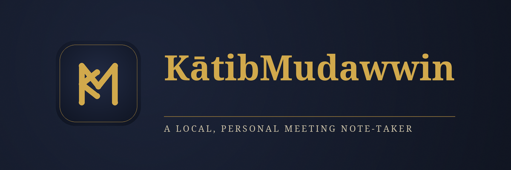

KātibMudawwin watches for Zoom meetings on your computer and quietly
writes you a transcript and summary when they're done. Everything happens
locally -- nothing leaves your machine unless you turn on cloud
summarization yourself.

*(Linux only, for now.)*

## Install

Open a terminal and paste this in:

```bash
curl -fsSL https://raw.githubusercontent.com/towfiq-ul/KatibMudawwin/develop/install.sh | bash
```

It installs everything it needs on its own (you may be asked for your
password once, to install a few system packages).

Prefer a regular installable app instead? Grab the latest `.deb`, `.rpm`,
or AppImage from the [Releases page](https://github.com/towfiq-ul/KatibMudawwin/releases).

## Run it

```bash
cd ~/KatibMudawwin
make start          # starts the engine -- watches for meetings in the background
make desktop-run    # opens the app window
```

Join a Zoom meeting like normal. When it ends, your notes show up in the
app.

## Privacy

This records audio from your meetings, including other participants, and
keeps it on your machine. Make sure you have consent to record before
using it.

## Learn more

Everything else -- other install options, running it in the background,
summarizing notes, autostart, how it's built, macOS/Windows support,
contributing -- lives in [`docs/`](docs/):

- [docs/installation.md](docs/installation.md)
- [docs/usage.md](docs/usage.md)
- [docs/architecture.md](docs/architecture.md)
- [CONTRIBUTING.md](CONTRIBUTING.md)
